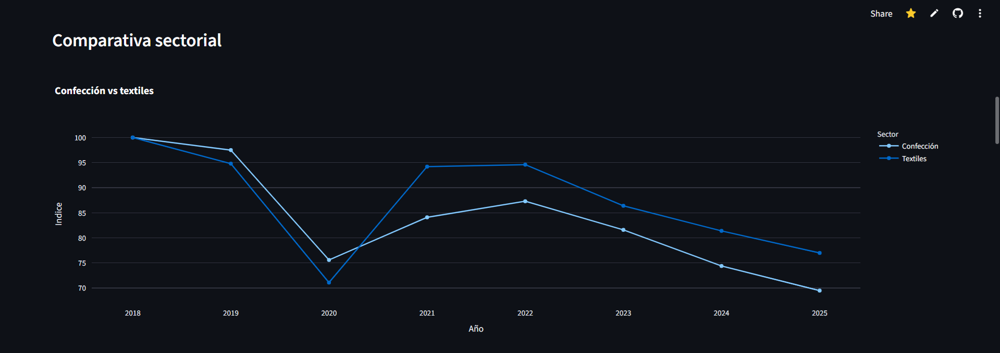

# Análisis de la Industria Textil y de Confección en México (2018–2025)

Proyecto de análisis de datos enfocado en la evolución de la industria textil y de confección en México utilizando Python, Streamlit, Power BI y visualización de datos interactiva.

---

## Descripción del Proyecto

Este proyecto analiza el comportamiento de la industria textil y de confección mexicana entre 2018 y 2025 a través de indicadores de producción, exportaciones, importaciones y balanza comercial.

El objetivo principal fue identificar señales de recuperación, desaceleración y posibles cambios estructurales dentro de la cadena manufacturera nacional, particularmente en sectores relacionados con prendas de vestir y manufactura textil.

El análisis combina exploración de datos, visualización interactiva y observaciones económicas para evaluar tendencias relevantes dentro del sector manufacturero mexicano.

---

## Objetivos del Análisis

- Analizar el desempeño de la industria de confección y textil entre 2018 y 2025.
- Comparar el comportamiento de exportaciones e importaciones del sector prendas.
- Identificar señales de recuperación económica post-pandemia.
- Evaluar posibles cambios estructurales dentro de la manufactura textil mexicana.
- Comunicar hallazgos mediante dashboards interactivos y visualizaciones ejecutivas.

---

## Herramientas Utilizadas

- Python
- Pandas
- Streamlit
- Plotly
- Power BI
- Excel

---

## Principales Hallazgos

- La industria de confección en México mostró una caída importante entre 2018 y 2025, manteniéndose por debajo de niveles pre-pandemia.
- El sector textil presentó una recuperación más sólida después de 2020 y conservó un mayor dinamismo relativo frente a confección.
- Las exportaciones del sector prendas crecieron significativamente entre 2021 y 2024.
- Las importaciones aumentaron más rápidamente que las exportaciones después de 2021.
- A partir de 2022 la balanza comercial del sector se volvió negativa, mostrando una mayor dependencia de productos importados.
- Los resultados podrían sugerir una transformación estructural gradual dentro de la industria textil mexicana.

---

## Implicaciones del Análisis

Los resultados sugieren posibles cambios estructurales dentro de la industria textil y de confección en México.

Aunque el país mantiene actividad exportadora relevante, el crecimiento acelerado de las importaciones y el menor dinamismo de la confección podrían indicar una presión competitiva creciente dentro del mercado nacional, particularmente en segmentos relacionados con consumo masivo y fast fashion.

Al mismo tiempo, la resiliencia observada en algunos segmentos textiles podría estar relacionada con una especialización progresiva hacia productos de mayor valor agregado.

---

## Dashboard Interactivo

[Ver aplicación en Streamlit](https://urwvzcawskdthirkpfsxmj.streamlit.app/)

---

## Vista Previa del Dashboard

### Dashboard Principal



### Dashboard Power BI


---

## Estructura del Proyecto

```plaintext
mexico-manufacturing-analysis
│
├── data
│   ├── Exportaciones.xlsx
│   ├── Importaciones.xlsx
│   ├── Indicadores confeccion.xls
│   └── Indicadores textiles.xls
│
├── visuals
│   ├── dashboard.png
│   ├── powerbi_dashboard.png
│   └── Industria Textil Mexicana.pdf
│
├── README.md
└── .gitignore
